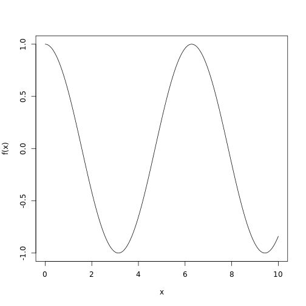

```r
## Another form of fibloop

fibLoop3 <- function(n) {
    if (n < 0 | round(n) != n) {
        warning("Invalid")
        return(NA)
    }
    sofar <- rep(1, n + 1)
    sofar[2] <- 1
    for (k in 3:n) {
        sofar[k] <- sofar[k - 1] + sofar[k - 2]
    }
    return(sofar[k])
}

fibLoop3(6)
```

```
## [1] 8
```

```r

fibRecurse <- function(n) {
    if (n == 1) {
        return(1)
    } else {
        if (n == 0) 
            return(0)
    }
    thisF <- fibRecurse(n - 1) + fibRecurse(n - 2)
    return(thisF)
}

beforeTime <- Sys.time()
fibRecurse(28)
```

```
## [1] 317811
```

```r
as.numeric(Sys.time() - beforeTime)
```

```
## [1] 3.496
```

```r

beforeTime <- Sys.time()
fibRecurse(29)
```

```
## [1] 514229
```

```r
as.numeric(Sys.time() - beforeTime)
```

```
## [1] 6.201
```

```r

## fibRecurse is so slow because it cyclically adds up all the numbers in the
## fibonacci sequence to return the nth number. The higher the nth number,
## the more additions required to reach it, thus taking up more time.

## fibRecurse(40) I would guess would take five minutes.

addNseq <- function(n) {
    if (n < 2) 
        return(n)
    return(n + addNseq(n - 1))
}

addNseq(5)
```

```
## [1] 15
```

```r

addRecursively <- function(v) {
    if (length(v) == 1) 
        return(v) else {
        c(v[1] + addRecursively(v[-1]))
    }
}

addRecursively(1:6)
```

```
## [1] 21
```

```r
addRecursively(c(1, 2, 3, 4))
```

```
## [1] 10
```

```r

## Looping version of addNSeq

addNSeqloop <- function(n) {
    res <- 0
    for (k in 1:n) {
        res <- res + k
    }
    return(res)
}

addNSeqloop(7)
```

```
## [1] 28
```

```r

## Looping version of addRecursively
addVec <- function(n) {
    res <- 0
    for (k in 1:length(n)) {
        res <- res + n[k]
    }
    return(res)
}

addVec(c(1, 2, 3))
```

```
## [1] 6
```

```r
addVec(1:6)
```

```
## [1] 21
```

```r

## Non-loop version of addNseq

addnonloop <- function(n) {
    return(sum(n:0))
}

addnonloop(9)
```

```
## [1] 45
```

```r

## Non-loop version of addRecursively

addnonloop2 <- function(n) {
    return(sum(n))
}

addnonloop2(1:7)
```

```
## [1] 28
```

```r

simpleRiemann <- function(f, a = 0, b = 1, n = 3) {
    rectangleWidth = (b - a)/n
    midpoints <- seq(a + rectangleWidth/2, b - rectangleWidth/2, length = n)
    rectangleAreas <- sapply(midpoints, f) * rectangleWidth
    return(sum(rectangleAreas))
}

integrateRiemann <- function(f, a = 0, b = 1) {
    nbins <- 5
    biggerBins <- simpleRiemann(f, a = a, b = b, n = nbins)
    for (k in 1:5) {
        nbins <- nbins * 10  # much smaller bins
        smallerBins <- simpleRiemann(f, a = a, b = b, n = nbins)
        if (abs(smallerBins - biggerBins) < 1e-05) 
            break
        biggerBins <- smallerBins
    }
    return(smallerBins)
}

## The for() loop only goes to 5 because there are only 5 bins

## BiggerBins represents the best case for integration, whereas smallerBins
## represents the less accurate case for integration (used when functions are
## difficult to integrate). biggerBins <- smallerBins makes the integration
## sequential, whereby the worse case (smallerBins) becomes the best case
## (biggerBins) as more integrations are done until the comparison if
## (abs(smallerBins - biggerBins)) < 1e-05.

## In the worst case there will be 5 *10^5 bins

## Modified integrateRecursive with worst case limit and tolerance as
## arguments

integrateRecursive <- function(f, a = 0, b = 1, lim = 1e-05, origwidth = b - 
    a) {
    bigBins <- simpleRiemann(f, a = a, b = b, n = 5)
    smallBins <- simpleRiemann(f, a = a, b = b, n = 10)
    if (abs(bigBins - smallBins) < lim) {
        return(smallBins)
    } else {
        if ((b - a) < origwidth/10000) {
            warning("Hit integration limit")
            return(smallBins)
        }
        mid <- (a + b)/2
        total <- integrateRecursive(f, a = a, b = mid, lim = lim, origwidth = origwidth) + 
            integrateRecursive(f, a = mid, b = b, lim = lim, origwidth = origwidth)
        return(total)
    }
}

## Test Cases with computations in LaTeX as well
integrateRecursive(function(x) 10 * x, 0, 5)
```

```
## [1] 125
```

$\int_0^5 10xdx = 5x^2|_0^5 = 125$

```r
integrateRecursive(cos, 0, 3)
```

```
## [1] 0.1411
```

$\int_0^5 cos(x)dx = sin(x)|_0^3 = sin(3) - sin(0) = .14$

```r
## Integral that hits 'worst case' limit for recursion

integrateRecursive(function(x) {
    sin(1/x)
}, 0, 1)
```

```
## Warning: Hit integration limit Warning: Hit integration limit Warning: Hit
## integration limit Warning: Hit integration limit Warning: Hit integration
## limit Warning: Hit integration limit Warning: Hit integration limit
## Warning: Hit integration limit Warning: Hit integration limit Warning: Hit
## integration limit Warning: Hit integration limit Warning: Hit integration
## limit Warning: Hit integration limit Warning: Hit integration limit
## Warning: Hit integration limit Warning: Hit integration limit
```

```
## [1] 0.5043
```

```r

gaussQuadrature <- function(f, a = 0, b = 1) {
    z <- c(c(-1, 1) * sqrt((3 - 2 * sqrt(6/5))/7), c(-1, 1) * sqrt((3 + 2 * 
        sqrt(6/5))/7))
    w <- c(rep((18 + sqrt(30))/36, 2), rep((18 - sqrt(30))/36, 2))
    x <- ((b - a)/2) * z + (a + b)/2
    return(((b - a)/2) * sum(w * sapply(x, f)))
}

gaussQuadrature(function(x) 3 * x^15, 0, 10)
```

```
## [1] 1.797e+15
```

$\int_0^{10} 3x^{15}dx =frac{3x^16}{16}|_0^10 = 1.797084 * 10^{15}$

```r
## gaussQuadrature stops working at the power of 318 for the following
## function:
gaussQuadrature(function(x) 3 * x^317, 0, 10)
```

```
## [1] 6.466e+307
```

```r

gaussQuadrature(function(x) 3 * x^318, 0, 10)
```

```
## [1] Inf
```

```r

## sin and cos test cases
gaussQuadrature(function(x) sin(x), 0, 0.1)  ##Actual: .0049958347
```

```
## [1] 0.004996
```

```r

gaussQuadrature(function(x) sin(x), 0, 1)  ##Actual: .4596977
```

```
## [1] 0.4597
```

```r

gaussQuadrature(function(x) sin(x), 0, 10)  ##Actual: 1.83907
```

```
## [1] 2.125
```

```r

## gaussQuadrature not accurate when interval is as large as 10

integrateRecursive2 <- function(f, a = 0, b = 1, lim = 1e-05) {
    bigBins <- gaussQuadrature(f, a = a, b = b)
    mid <- (a + b)/2
    smallBins <- gaussQuadrature(f, a = a, b = mid) + gaussQuadrature(f, a = mid, 
        b = b)
    if (abs(bigBins - smallBins) < lim) 
        return(smallBins) else {
        mid <- (a + b)/2
        total <- integrateRecursive2(f, a = a, b = mid) + integrateRecursive2(f, 
            a = mid, b = b)
        return(total)
    }
}

integrateRecursive2(function(x) sin(x), 0, 10)  ##Actual: 1.83907
```

```
## [1] 1.839
```

```r

## integrateRecursive2 works for large intervals

plotF <- function(f, a = 0, b = 1) {
    getX <- function(f, a = 0, b = 1) {
        mid <- (a + b)/2
        bigBins <- simpleRiemann(f, a = a, b = b, n = 101)
        smallBins <- gaussQuadrature(f, a = a, b = b)
        if (abs(bigBins - smallBins) < 1e-05) {
            return(seq(a, b, length = 101))
        } else {
            return(c(getX(f, a, mid), getX(f, mid, b)))
        }
    }
    x <- getX(f, a, b)
    plot(f(x) ~ x, pch = 20, cex = 0.2, type = "l")
}

plotF(sin, 0, 2 * pi)
```

 

```r

plotF(cos, 0, 10)
```

 

