```r
puppy <-readPNG(getURLContent("http://dtkaplan.github.io/ScientificComputing/Resources/Images/mindo.png"))

COMP121::canvas(x=c(1,220),y=c(1,220),asp=1)
PuppyFace <- puppy[40:120,90:170,]
rasterImage(PuppyFace,1,1,216,198)
```

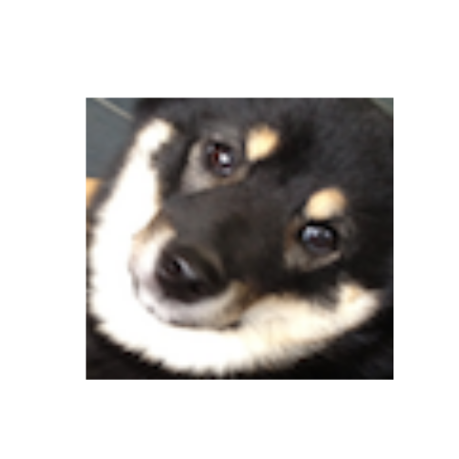

```r

COMP121::canvas(x=c(1,220),y=c(1,220),asp=1)
PuppyPaw <- puppy[160:195,0:50,]
rasterImage(PuppyPaw,1,1,216,198)
```

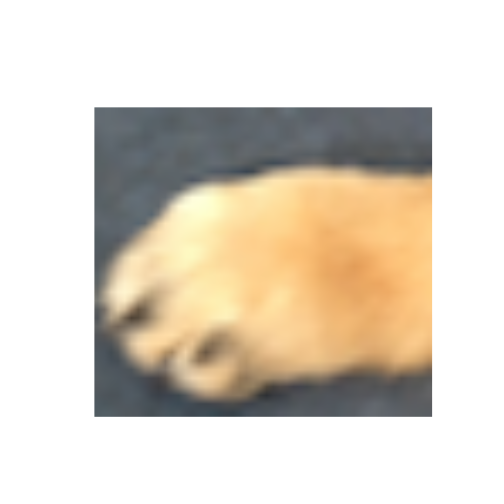

```r

COMP121::canvas(x=c(1,220),y=c(1,220),asp=1)
PuppyTag <- puppy[110:140,100:120,]
rasterImage(PuppyTag,1,1,216,198)
```

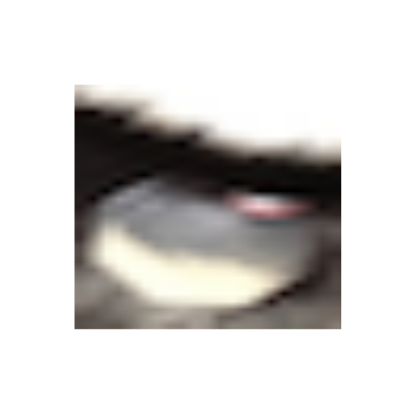

```r

picframe <- function (image,frame,range,mirror=FALSE,neg=FALSE,bright=1,col=0){
  revfun <- if (mirror) rev else I
  negfun <- if(neg) function(x){1-x} else I
  Photo <- image[frame[[1]],frame[[2]]]
  rflength <- length(frame[[1]])
  cflength <- length(frame[[2]])
  if (range != 0){
    Photo <- rbind(negfun(col+bright*Photo[revfun(1:range),]),
                   Photo,
                   negfun(col+bright*Photo[revfun((rflength-range+1):rflength),]))
    Photo <- cbind(negfun(col+bright*Photo[,revfun(1:range)]),
                   Photo,
                   negfun(col+bright*Photo[,revfun((cflength-range+1):cflength)]))
  } 
  return(Photo)
}

display <- function(image){
  s <- dim(image)
  COMP121::canvas(x=c(1,s[2]),y=c(1,s[1]),asp=1)
  rasterImage(image,1,1,s[2], s[1])
}
```


```r
piano <- readPNG(getURLContent("http://www.jppiano.com/wpimages/wpbf785118_00.png"))

##Full piano with no frame
display(picframe(piano[,,1], frame=list(1:300,1:310),range=0))
```

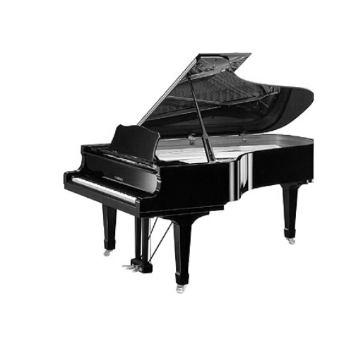

```r

##Cropped piano with no frame
display(picframe(piano[,,1], list(100:200,150:250),range=0))
```

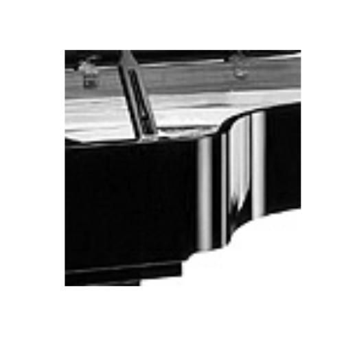

```r

##Full piano with straight frame and max brightness frame
display(picframe(piano[,,1], list(1:300,1:310),range=50))
```

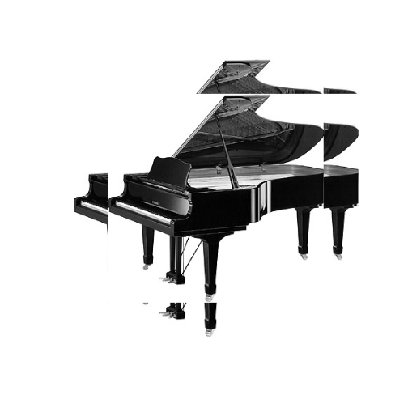

```r

##Full piano with mirrored frame and mid brightness frame
display(picframe(piano[,,1], list(1:300,1:310),75,mirror=TRUE,bright=.5))
```

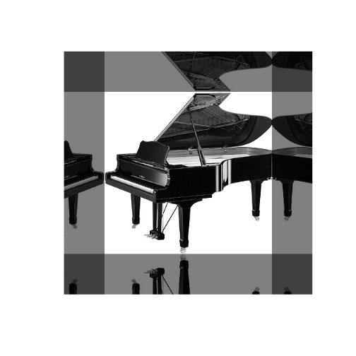

```r

##Full piano with zero brightness frame
display(picframe(piano[,,1], list(1:300,1:310),75,bright=0))
```

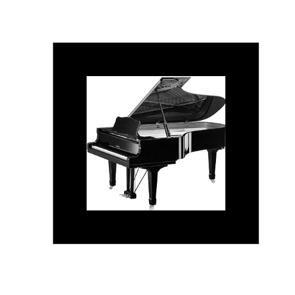

```r

colordisplay <- function(plane1,plane2,plane3){
  s <- dim(plane1)
    COMP121::canvas(x=c(1,s[2]),y=c(1,s[1]),asp=1)
    colplane <- array(c(plane1,plane2,plane3),dim<-c(s,3))
  rasterImage(colplane,1,1,s[2], s[1])
}

##Color piano
colordisplay(picframe(piano[,,1], list(1:300,1:310),range=0),
             picframe(piano[,,2], list(1:300,1:310),range=0),
             picframe(piano[,,3], list(1:300,1:310),range=0))
```

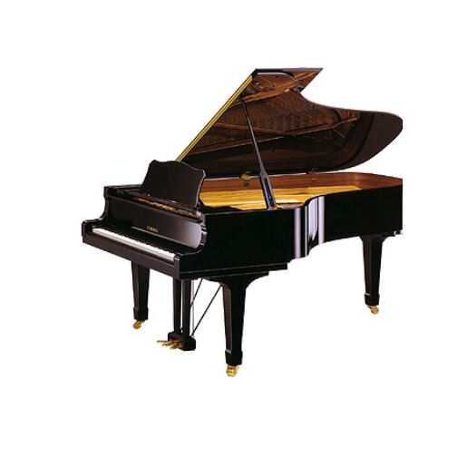

```r

##Piano with straight negative frame
colordisplay(picframe(piano[,,1], list(1:300,1:310),range=50,neg=TRUE),
             picframe(piano[,,2], list(1:300,1:310),range=50,neg=TRUE),
             picframe(piano[,,3], list(1:300,1:310),range=50,neg=TRUE))
```

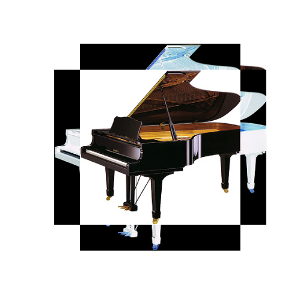

```r

##Piano with red frame
colordisplay(picframe(piano[,,1], list(1:300,1:310),range=50,bright=0,col=1),
             picframe(piano[,,2], list(1:300,1:310),range=50,bright=0),
             picframe(piano[,,3], list(1:300,1:310),range=50,bright=0))
```

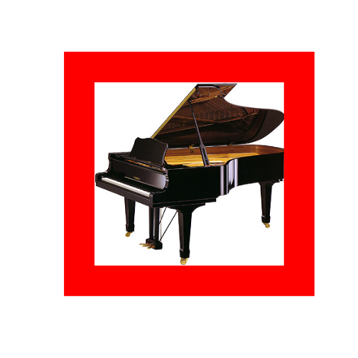

```r

##Piano with yellow frame
colordisplay(picframe(piano[,,1], list(1:300,1:310),range=50,bright=0,col=1),
             picframe(piano[,,2], list(1:300,1:310),range=50,bright=0,col=1),
             picframe(piano[,,3], list(1:300,1:310),range=50,bright=0,col=0))
```

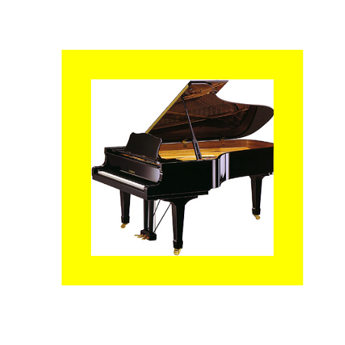

```r

##Piano with turquoise frame and straight faded piano frame
colordisplay(picframe(piano[,,1], list(1:300,1:310),range=50,bright=0,col=0),
             picframe(piano[,,2], list(1:300,1:310),range=50,bright=.5,col=.5),
             picframe(piano[,,3], list(1:300,1:310),range=50,bright=.5,col=.5))
```

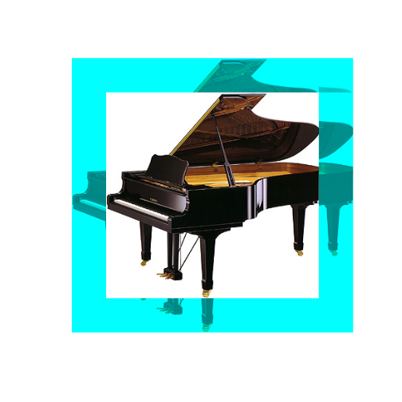

